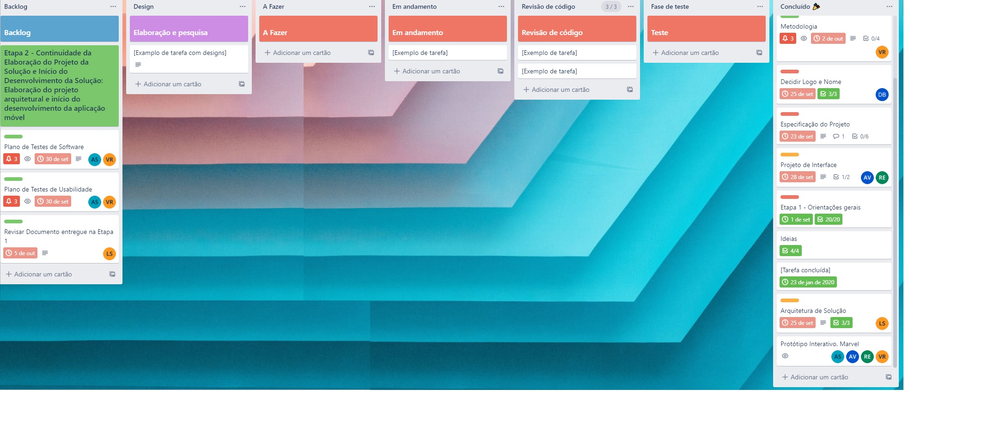

# Metodologia

Pré-requisitos: <a href="2-Especificação do Projeto.md"> Documentação de Especificação</a>

Descreva aqui a metodologia de trabalho do grupo para atacar o problema. Definições sobre os ambiente de trabalho utilizados pela  equipe para desenvolver o projeto. Abrange a relação de ambientes utilizados, a estrutura para gestão do código fonte, além da definição do processo e ferramenta através dos quais a equipe se organiza (Gestão de Times).

## Relação de Ambientes de Trabalho

Os artefatos do projeto são desenvolvidos a partir de diversas plataformas e a relação dos ambientes com seu respectivo propósito deverá ser apresentada em uma tabela que especifica que detalha Ambiente, Plataforma e Link de Acesso. 
   
| Ambiente      | Plataforma                | Link de Acesso             |
|---------------|---------------------------|----------------------------|
| Repositório de Código Fonte | GitHub | https://github.com/ICEI-PUC-Minas-PMV-ADS/pmv-ads-2022-2-e3-proj-mov-t2-comanda-digital |
| Documentação do Projeto | GitHub | https://github.com/ICEI-PUC-Minas-PMV-ADS/pmv-ads-2022-2-e3-proj-mov-t2-comanda-digital |
| Projeto de Interface (Wireframes) | Lucidchart | https://lucid.app/documents/view/bf8c8345-99a7-4123-bbe9-936422fafdc0 |
| Gerenciamento do Projeto | Trello | https://trello.com/b/lmrA1giu/eixo-3-app-gest%C3%A3o-de-comanda |
| Protótipo | MarvelApp | https://marvelapp.com/prototype/a6d8hh5 |

## Controle de Versão

A ferramenta de controle de versão adotada no projeto foi o
[Git](https://git-scm.com/), sendo que o [Github](https://github.com)
foi utilizado para hospedagem do repositório.

O projeto segue a seguinte convenção para o nome de branches:

- `main`: versão estável já testada do software
- `unstable`: versão já testada do software, porém instável
- `testing`: versão em testes do software
- `dev`: versão de desenvolvimento do software

Quanto à gerência de issues, o projeto adota a seguinte convenção para
etiquetas:

- `documentation`: melhorias ou acréscimos à documentação
- `bug`: uma funcionalidade encontra-se com problemas
- `enhancement`: uma funcionalidade precisa ser melhorada
- `feature`: uma nova funcionalidade precisa ser introduzida

## Gerenciamento de Projeto

### Divisão de Papéis

A equipe opera por meio de metodologias ágeis, tendo escolhido o Scrum como principal base para definição do processo de desenvolvimento.

A equipe está organizada da seguinte maneira:

- Scrum Master: Daniel Begas;
- Product Owner: André Vieira;
- Equipe de Desenvolvimento: André Soares, André Vieira, Daniel Begas, Lívia Cristina, Robson Levi, Vânia Rezende;
- Equipe de Design: André Soares, Lívia Cristina, Robson Levi, Vânia Rezende .

### Processo

Para organização e distribuição das tarefas do projeto, a equipe está utilizando o quadro Kanban (Trello) construído com as seguintes listas:

- **Backlog:** Nesta lista estão os itens a serem implementados do projeto, são alocados em cartões individuais. A lista também reúne itens que o time deseja trabalhar ou nos quais precisará trabalhar no futuro, mas que ainda estão sendo avaliados.
- **Em andamento:** Quando uma tarefa tiver sido iniciada, ela é movida para cá.
- **Concluído:** Nesta lista são colocadas as tarefas que passaram pelos testes e controle de qualidade e estão prontos para ser entregues ao usuário. Pois já foram revisadas e aprovadas, não há mais edições ou revisões necessárias.

O quadro Kanban do grupo no Trello está disponível através da seguinte URL: https://trello.com/b/lmrA1giu/eixo-3-app-gest%C3%A3o-de-comanda

Este quadro é apresentado, no estado atual, na figura a seguir:

   

 

### Ferramentas

As ferramentas empregadas no projeto são:

| Ambiente                                              | Plataforma                 |
| ------                                                | ----------------------------   
| Codificação                                           | Visual Studio Code         |                                            
| Comunicação                                           | Teams, Whatsapp            |                                           
| Repositório, documentação e gerenciamento do projeto  | Github                    | 
| Projeto de Interface, Wireframes, Protótipos          | Lucid Chart, MarvelAPP     |

